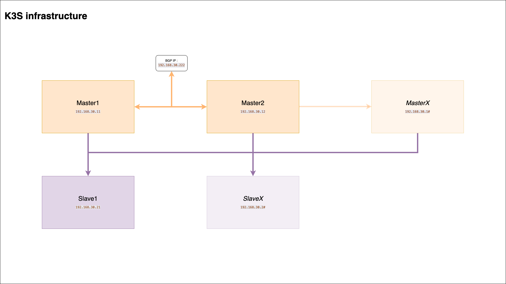
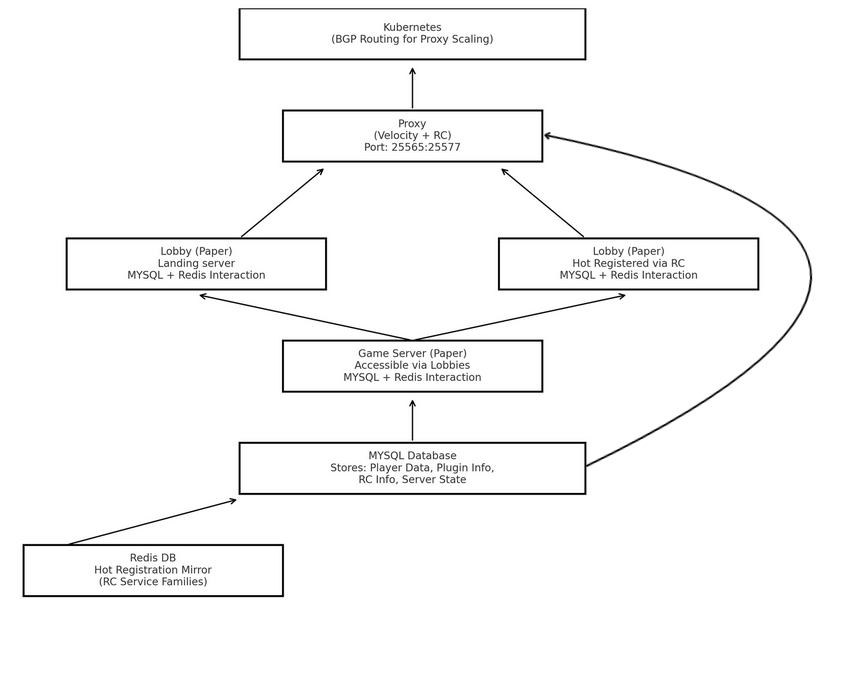

# Minecraft Server on Kubernetes 🚀

[](https://releases.ubuntu.com/22.04/)
[](https://k3s.io)
[](https://www.vagrantup.com)

[](https://www.python.org)
[](https://www.ansible.com)
[](https://www.gnu.org/software/bash/)

[](https://www.docker.com)
[](https://gradle.org)
[](https://maven.apache.org)


[](https://github.com/basilelt/SAE503/issues)
[](https://github.com/basilelt/SAE503/stargazers)

> Easily deploy and manage Minecraft servers on Kubernetes with a streamlined CLI tool!  

## Table of Contents
- [Minecraft Server on Kubernetes 🚀](#minecraft-server-on-kubernetes-)
  - [Table of Contents](#table-of-contents)
  - [Overview](#overview)
  - [Installation](#installation)
    - [Prerequisites](#prerequisites)
    - [Steps to Install the CLI](#steps-to-install-the-cli)
    - [Usage](#usage)
      - [Available Commands](#available-commands)
    - [Installing Kubernetes with Ansible](#installing-kubernetes-with-ansible)
      - [Prerequisites](#prerequisites-1)
      - [Step-by-Step Deployment](#step-by-step-deployment)
      - [Deploying Kubernetes with Ansible](#deploying-kubernetes-with-ansible)
      - [Kubernetes Operations](#kubernetes-operations)
  - [Infrastructure diagram](#infrastructure-diagram)
  - [Ansible diagrams](#ansible-diagrams)
  - [Application diagram](#application-diagram)
  - [Website diagram](#website-diagram)
  - [Organization](#organization)

## Overview

This repository contains all the tools necessary to **deploy an entire infrastructure for Minecraft servers on Kubernetes**.  
It includes a CLI tool that automates:
- Setting up Kubernetes clusters
- Managing DNS entries
- Installing essential tools with a few simple commands


## Installation

### Prerequisites

- **Bash**: The CLI is built using Bash scripting.
- **Python 3**: Required for creating virtual environments and running Ansible.
- **Ansible**: Automation tool for deploying Kubernetes.
- **Git**: For cloning the repository.
- **Homebrew (macOS)** or **apt-get (Linux)**: For installing necessary packages.

### Steps to Install the CLI

1. **Clone the Repository**

   ```bash
   git clone https://github.com/your-repo/sae-cli.git
   cd sae-cli
   ```

2. **Install the CLI**

   Run the `install_cli.sh` script to install the CLI.

   ```bash
   ./install_cli.sh sae
   ```

   Replace `sae` with your desired CLI name. This script will:

   - Detect your operating system.
   - Install necessary dependencies like `jq`.
   - Create symlinks for easy access to the CLI commands.
   - Update your shell configuration files for command completion.

3. **Verify Installation**

   Close and reopen your terminal, then verify the installation by checking the CLI version or help.

   ```bash
   sae
   ```

4. **Complete Clone of the Project**
   To completely clone the project and its submodules use :

   ```
   sae git submod
   ```

### Usage

#### Available Commands

The SAE CLI provides a variety of commands categorized under different operations. Below is an overview of the available commands:

- **Local Machine Operations**
  - `docker prune`: Stop the stack of the project, removes all stopped containers, dangling images, unused networks and volumes.

  - `git submod`: Initialize and update submodules of the project.

  - `install ansible`: Installs Ansible locally.
  - `install docker`: Installs Docker locally.
  - `install flask`: Installs Flask to the project venv (install ansible).
  - `install kompose`: Installs Kompose locally.
  - `install vagrant`: Installs Vagrant locally.
  - `install vbox`: Installs VirtualBox locally (UTM on mac).

  - `kompose convert`: Converts the docker-compose file to Kubernetes manifests.

  - `ssh create`: Creates an SSH key pair.
  - `ssh deploy`: Deploys SSH keys to remote hosts.

  - `vagrant rl`: Reloads the Vagrant VMs.
  - `vagrant rm`: Destroy the Vagrant VMs.
  - `vagrant run`: Starts the Vagrant VMs.
  
- **Kubernetes Deployment**
  - `ansible kube install`: Installs Kubernetes on all hosts.
  - `ansible deploy docker`: Deploys Docker on master hosts.
  - `ansible deploy longhorn`: Deploys Longhorn on master hosts.
  - `ansible deploy manifests`: Deploys Kubernetes manifests on master hosts.
  - `ansible deploy registry`: Deploys a Docker registry on master hosts.
  
- **DNS Operations**
  - `dns host`: Modifies the hosts file to set up DNS entries.

### Installing Kubernetes with Ansible

Deploying a Kubernetes cluster using Ansible through the SAE CLI involves several steps. Follow the guide below to perform the deployment seamlessly.

#### Prerequisites

- **Remote Hosts**: Ensure you have access to the master and node nodes where Kubernetes will be installed.
- **SSH Access**: Set up SSH access to all remote hosts.
- **Ansible Inventory**: Configure your `k3s-ansible/inventory/my-cluster/hosts.ini` with the correct hostnames or IPs.
- **Ansible vars**: Configure your `k3s-ansible/inventory/my-cluster/group_vars/all.yml` with the correct values (ansible_user, ssh_key, ...).

#### Step-by-Step Deployment

1. **Set Up SSH Keys**

  Create an SSH key pair and deploy it to all your remote hosts.

  ```bash
  sae local ssh create
  sae local ssh deploy -u your_ssh_user -i master_ip
  sae local ssh deploy -u your_ssh_user -i node1_ip
  sae local ssh deploy -u your_ssh_user -i node2_ip
  sae local ssh deploy -u your_ssh_user -i node3_ip
  ```

  Replace `your_ssh_user` with your SSH username and `master_ip`, `node1_ip`, etc., with the respective IP addresses of your hosts.

2. **Install Kubernetes on Hosts and make them join the cluster**

  Use the CLI to run the Ansible playbook that installs Kubernetes.

  ```bash
  sae ansible kube install
  ```

  This command performs the following actions:

  - Loads utility methods.
  - Navigates to the directory specified in the runtime configuration.
  - Activates the virtual environment.
  - Executes the Ansible playbook `site.yml` using the inventory defined in `hosts.ini`.

#### Deploying Kubernetes with Ansible

  Use the CLI to run the Ansible playbooks that deploy the dependencies.

  - Install and set up a registry on the master hosts.
  ```bash
  sae ansible deploy registry
  ```

  - Install docker on the master hosts and build/push the images for the future pods.
  ```bash
  sae ansible deploy docker
  ```

  - Install and setup Longhorn on the master hosts. Then creates the storage class and PVCs needing initialization. Finally, inits those PVCs with data (source codes, etc).
  ```bash
  sae ansible deploy longhorn
  ```

  - Deploy the Kubernetes manifests on the master hosts (config maps, deployments, services, etc).
  ```bash
  sae ansible deploy manifests
  ```

#### Kubernetes Operations

Once deployed and running, you can access the Minecraft server using the IP address of the master node (if multiple masters then use the BGP IP set up in `k3s-ansible/inventory/my-cluster/group_vars/all.yml`). The server will be accessible on port 25565 (default).

Common commands to interact with the Kubernetes cluster include:
(for vagrant testing use `vagrant ssh master1`)
- `kubectl get nodes`: List all nodes in the cluster.
- `kubectl get pods`: List all pods in the cluster.
- `kubectl get svc`: List all services in the cluster.
- `kubectl get cm`: List all config maps in the cluster.
- `kubectl get pvc`: List all persistent volume claims in the cluster.
- `kubectl get pv`: List all persistent volumes in the cluster.
- `kubectl get sc`: List all storage classes in the cluster.
- `kubectl get ns`: List all namespaces in the cluster.
- `kubectl get all`: List all resources in the cluster.
- `kubectl describe pod <pod-name>`: Describe a specific pod.
- `kubectl logs <pod-name>`: View logs of a specific pod.

## Infrastructure diagram


## Ansible diagrams
- [Kubernetes](./graphs/site.md)
- [Docker](./graphs/docker_deploy.md)
- [Longhorn](./graphs/longhorn_deploy.md)
- [Manifests](./graphs/manifests_deploy.md)
- [Registry](./graphs/registry_deploy.md)

## Application Overview

In the [src/](src/) directory, you’ll find the core application logic, including its primary modules and configuration files. This folder serves as the foundation for all functionalities within the project, ensuring modular development and straightforward maintenance.

## Application diagram


## Website diagram


## Organization
🗂️ View the full project organization board [here](https://github.com/users/basilelt/projects/1/views/8)
