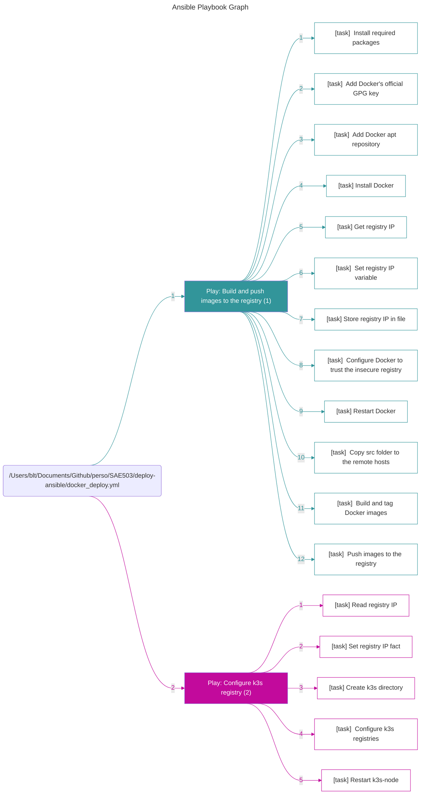

```mermaid
---
title: Ansible Playbook Graph
---
%%{ init: { "flowchart": { "curve": "bumpX" } } }%%
flowchart LR
	%% Start of the playbook '/Users/blt/Documents/Github/perso/SAE503/deploy-ansible/docker_deploy.yml'
	playbook_21aad8c7("/Users/blt/Documents/Github/perso/SAE503/deploy-ansible/docker_deploy.yml")
		%% Start of the play 'Play: Build and push images to the registry (1)'
		play_e12b4ac8["Play: Build and push images to the registry (1)"]
		style play_e12b4ac8 fill:#32959a,color:#ffffff
		playbook_21aad8c7 --> |"1"| play_e12b4ac8
		linkStyle 0 stroke:#32959a,color:#32959a
			task_486dcc05["[task]  Install required packages"]
			style task_486dcc05 stroke:#32959a,fill:#ffffff
			play_e12b4ac8 --> |"1"| task_486dcc05
			linkStyle 1 stroke:#32959a,color:#32959a
			task_8358141e["[task]  Add Docker's official GPG key"]
			style task_8358141e stroke:#32959a,fill:#ffffff
			play_e12b4ac8 --> |"2"| task_8358141e
			linkStyle 2 stroke:#32959a,color:#32959a
			task_739c03c1["[task]  Add Docker apt repository"]
			style task_739c03c1 stroke:#32959a,fill:#ffffff
			play_e12b4ac8 --> |"3"| task_739c03c1
			linkStyle 3 stroke:#32959a,color:#32959a
			task_8134d0fb["[task]  Install Docker"]
			style task_8134d0fb stroke:#32959a,fill:#ffffff
			play_e12b4ac8 --> |"4"| task_8134d0fb
			linkStyle 4 stroke:#32959a,color:#32959a
			task_bc0c13fb["[task]  Get registry IP"]
			style task_bc0c13fb stroke:#32959a,fill:#ffffff
			play_e12b4ac8 --> |"5"| task_bc0c13fb
			linkStyle 5 stroke:#32959a,color:#32959a
			task_e84d2dab["[task]  Set registry IP variable"]
			style task_e84d2dab stroke:#32959a,fill:#ffffff
			play_e12b4ac8 --> |"6"| task_e84d2dab
			linkStyle 6 stroke:#32959a,color:#32959a
			task_65212d61["[task]  Store registry IP in file"]
			style task_65212d61 stroke:#32959a,fill:#ffffff
			play_e12b4ac8 --> |"7"| task_65212d61
			linkStyle 7 stroke:#32959a,color:#32959a
			task_e5deec6c["[task]  Configure Docker to trust the insecure registry"]
			style task_e5deec6c stroke:#32959a,fill:#ffffff
			play_e12b4ac8 --> |"8"| task_e5deec6c
			linkStyle 8 stroke:#32959a,color:#32959a
			task_d550e2f1["[task]  Restart Docker"]
			style task_d550e2f1 stroke:#32959a,fill:#ffffff
			play_e12b4ac8 --> |"9"| task_d550e2f1
			linkStyle 9 stroke:#32959a,color:#32959a
			task_8b24dce5["[task]  Copy src folder to the remote hosts"]
			style task_8b24dce5 stroke:#32959a,fill:#ffffff
			play_e12b4ac8 --> |"10"| task_8b24dce5
			linkStyle 10 stroke:#32959a,color:#32959a
			task_ab10f4f8["[task]  Build and tag Docker images"]
			style task_ab10f4f8 stroke:#32959a,fill:#ffffff
			play_e12b4ac8 --> |"11"| task_ab10f4f8
			linkStyle 11 stroke:#32959a,color:#32959a
			task_9ba6f58d["[task]  Push images to the registry"]
			style task_9ba6f58d stroke:#32959a,fill:#ffffff
			play_e12b4ac8 --> |"12"| task_9ba6f58d
			linkStyle 12 stroke:#32959a,color:#32959a
		%% End of the play 'Play: Build and push images to the registry (1)'
		%% Start of the play 'Play: Configure k3s registry (2)'
		play_0c5cbf8c["Play: Configure k3s registry (2)"]
		style play_0c5cbf8c fill:#c20a9c,color:#ffffff
		playbook_21aad8c7 --> |"2"| play_0c5cbf8c
		linkStyle 13 stroke:#c20a9c,color:#c20a9c
			task_37f7c7fa["[task]  Read registry IP"]
			style task_37f7c7fa stroke:#c20a9c,fill:#ffffff
			play_0c5cbf8c --> |"1"| task_37f7c7fa
			linkStyle 14 stroke:#c20a9c,color:#c20a9c
			task_4880eb2e["[task]  Set registry IP fact"]
			style task_4880eb2e stroke:#c20a9c,fill:#ffffff
			play_0c5cbf8c --> |"2"| task_4880eb2e
			linkStyle 15 stroke:#c20a9c,color:#c20a9c
			task_513864c1["[task]  Create k3s directory"]
			style task_513864c1 stroke:#c20a9c,fill:#ffffff
			play_0c5cbf8c --> |"3"| task_513864c1
			linkStyle 16 stroke:#c20a9c,color:#c20a9c
			task_afb11225["[task]  Configure k3s registries"]
			style task_afb11225 stroke:#c20a9c,fill:#ffffff
			play_0c5cbf8c --> |"4"| task_afb11225
			linkStyle 17 stroke:#c20a9c,color:#c20a9c
			task_1eceaf48["[task]  Restart k3s-node"]
			style task_1eceaf48 stroke:#c20a9c,fill:#ffffff
			play_0c5cbf8c --> |"5"| task_1eceaf48
			linkStyle 18 stroke:#c20a9c,color:#c20a9c
		%% End of the play 'Play: Configure k3s registry (2)'
	%% End of the playbook '/Users/blt/Documents/Github/perso/SAE503/deploy-ansible/docker_deploy.yml'

```
