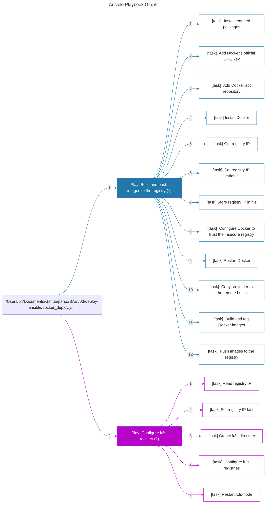

```mermaid
---
title: Ansible Playbook Graph
---
%%{ init: { "flowchart": { "curve": "bumpX" } } }%%
flowchart LR
	%% Start of the playbook '/Users/blt/Documents/Github/perso/SAE503/deploy-ansible/docker_deploy.yml'
	playbook_dc2ebe73("/Users/blt/Documents/Github/perso/SAE503/deploy-ansible/docker_deploy.yml")
		%% Start of the play 'Play: Build and push images to the registry (1)'
		play_81e9b3ac["Play: Build and push images to the registry (1)"]
		style play_81e9b3ac fill:#2278aa,color:#ffffff
		playbook_dc2ebe73 --> |"1"| play_81e9b3ac
		linkStyle 0 stroke:#2278aa,color:#2278aa
			task_d4d5b294["[task]  Install required packages"]
			style task_d4d5b294 stroke:#2278aa,fill:#ffffff
			play_81e9b3ac --> |"1"| task_d4d5b294
			linkStyle 1 stroke:#2278aa,color:#2278aa
			task_280cde9f["[task]  Add Docker's official GPG key"]
			style task_280cde9f stroke:#2278aa,fill:#ffffff
			play_81e9b3ac --> |"2"| task_280cde9f
			linkStyle 2 stroke:#2278aa,color:#2278aa
			task_c6e2f35b["[task]  Add Docker apt repository"]
			style task_c6e2f35b stroke:#2278aa,fill:#ffffff
			play_81e9b3ac --> |"3"| task_c6e2f35b
			linkStyle 3 stroke:#2278aa,color:#2278aa
			task_d5db7f59["[task]  Install Docker"]
			style task_d5db7f59 stroke:#2278aa,fill:#ffffff
			play_81e9b3ac --> |"4"| task_d5db7f59
			linkStyle 4 stroke:#2278aa,color:#2278aa
			task_9cc1299b["[task]  Get registry IP"]
			style task_9cc1299b stroke:#2278aa,fill:#ffffff
			play_81e9b3ac --> |"5"| task_9cc1299b
			linkStyle 5 stroke:#2278aa,color:#2278aa
			task_b0c8ae74["[task]  Set registry IP variable"]
			style task_b0c8ae74 stroke:#2278aa,fill:#ffffff
			play_81e9b3ac --> |"6"| task_b0c8ae74
			linkStyle 6 stroke:#2278aa,color:#2278aa
			task_cb8f5f3d["[task]  Store registry IP in file"]
			style task_cb8f5f3d stroke:#2278aa,fill:#ffffff
			play_81e9b3ac --> |"7"| task_cb8f5f3d
			linkStyle 7 stroke:#2278aa,color:#2278aa
			task_aa1b9fcb["[task]  Configure Docker to trust the insecure registry"]
			style task_aa1b9fcb stroke:#2278aa,fill:#ffffff
			play_81e9b3ac --> |"8"| task_aa1b9fcb
			linkStyle 8 stroke:#2278aa,color:#2278aa
			task_6309fe37["[task]  Restart Docker"]
			style task_6309fe37 stroke:#2278aa,fill:#ffffff
			play_81e9b3ac --> |"9"| task_6309fe37
			linkStyle 9 stroke:#2278aa,color:#2278aa
			task_2957622c["[task]  Copy src folder to the remote hosts"]
			style task_2957622c stroke:#2278aa,fill:#ffffff
			play_81e9b3ac --> |"10"| task_2957622c
			linkStyle 10 stroke:#2278aa,color:#2278aa
			task_d8da9349["[task]  Build and tag Docker images"]
			style task_d8da9349 stroke:#2278aa,fill:#ffffff
			play_81e9b3ac --> |"11"| task_d8da9349
			linkStyle 11 stroke:#2278aa,color:#2278aa
			task_c52db5d7["[task]  Push images to the registry"]
			style task_c52db5d7 stroke:#2278aa,fill:#ffffff
			play_81e9b3ac --> |"12"| task_c52db5d7
			linkStyle 12 stroke:#2278aa,color:#2278aa
		%% End of the play 'Play: Build and push images to the registry (1)'
		%% Start of the play 'Play: Configure k3s registry (2)'
		play_3f1beda7["Play: Configure k3s registry (2)"]
		style play_3f1beda7 fill:#b803c9,color:#ffffff
		playbook_dc2ebe73 --> |"2"| play_3f1beda7
		linkStyle 13 stroke:#b803c9,color:#b803c9
			task_f9004b4b["[task]  Read registry IP"]
			style task_f9004b4b stroke:#b803c9,fill:#ffffff
			play_3f1beda7 --> |"1"| task_f9004b4b
			linkStyle 14 stroke:#b803c9,color:#b803c9
			task_c570b5db["[task]  Set registry IP fact"]
			style task_c570b5db stroke:#b803c9,fill:#ffffff
			play_3f1beda7 --> |"2"| task_c570b5db
			linkStyle 15 stroke:#b803c9,color:#b803c9
			task_195d90ae["[task]  Create k3s directory"]
			style task_195d90ae stroke:#b803c9,fill:#ffffff
			play_3f1beda7 --> |"3"| task_195d90ae
			linkStyle 16 stroke:#b803c9,color:#b803c9
			task_5910bc9c["[task]  Configure k3s registries"]
			style task_5910bc9c stroke:#b803c9,fill:#ffffff
			play_3f1beda7 --> |"4"| task_5910bc9c
			linkStyle 17 stroke:#b803c9,color:#b803c9
			task_2f55658e["[task]  Restart k3s-node"]
			style task_2f55658e stroke:#b803c9,fill:#ffffff
			play_3f1beda7 --> |"5"| task_2f55658e
			linkStyle 18 stroke:#b803c9,color:#b803c9
		%% End of the play 'Play: Configure k3s registry (2)'
	%% End of the playbook '/Users/blt/Documents/Github/perso/SAE503/deploy-ansible/docker_deploy.yml'

```
