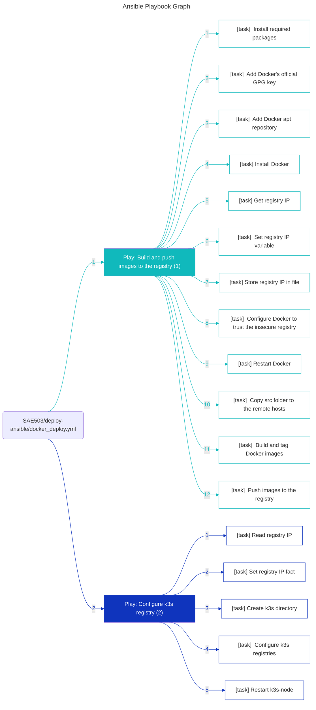

```mermaid
---
title: Ansible Playbook Graph
---
%%{ init: { "flowchart": { "curve": "bumpX" } } }%%
flowchart LR
	%% Start of the playbook 'SAE503/deploy-ansible/docker_deploy.yml'
	playbook_81ffe50b("SAE503/deploy-ansible/docker_deploy.yml")
		%% Start of the play 'Play: Build and push images to the registry (1)'
		play_b04e74b4["Play: Build and push images to the registry (1)"]
		style play_b04e74b4 fill:#10b9bc,color:#ffffff
		playbook_81ffe50b --> |"1"| play_b04e74b4
		linkStyle 0 stroke:#10b9bc,color:#10b9bc
			task_24f228d4["[task]  Install required packages"]
			style task_24f228d4 stroke:#10b9bc,fill:#ffffff
			play_b04e74b4 --> |"1"| task_24f228d4
			linkStyle 1 stroke:#10b9bc,color:#10b9bc
			task_50dfb526["[task]  Add Docker's official GPG key"]
			style task_50dfb526 stroke:#10b9bc,fill:#ffffff
			play_b04e74b4 --> |"2"| task_50dfb526
			linkStyle 2 stroke:#10b9bc,color:#10b9bc
			task_038b3260["[task]  Add Docker apt repository"]
			style task_038b3260 stroke:#10b9bc,fill:#ffffff
			play_b04e74b4 --> |"3"| task_038b3260
			linkStyle 3 stroke:#10b9bc,color:#10b9bc
			task_4c750c2f["[task]  Install Docker"]
			style task_4c750c2f stroke:#10b9bc,fill:#ffffff
			play_b04e74b4 --> |"4"| task_4c750c2f
			linkStyle 4 stroke:#10b9bc,color:#10b9bc
			task_6a562b3a["[task]  Get registry IP"]
			style task_6a562b3a stroke:#10b9bc,fill:#ffffff
			play_b04e74b4 --> |"5"| task_6a562b3a
			linkStyle 5 stroke:#10b9bc,color:#10b9bc
			task_c9112355["[task]  Set registry IP variable"]
			style task_c9112355 stroke:#10b9bc,fill:#ffffff
			play_b04e74b4 --> |"6"| task_c9112355
			linkStyle 6 stroke:#10b9bc,color:#10b9bc
			task_081a0239["[task]  Store registry IP in file"]
			style task_081a0239 stroke:#10b9bc,fill:#ffffff
			play_b04e74b4 --> |"7"| task_081a0239
			linkStyle 7 stroke:#10b9bc,color:#10b9bc
			task_7d2da0a9["[task]  Configure Docker to trust the insecure registry"]
			style task_7d2da0a9 stroke:#10b9bc,fill:#ffffff
			play_b04e74b4 --> |"8"| task_7d2da0a9
			linkStyle 8 stroke:#10b9bc,color:#10b9bc
			task_7c7b9c8c["[task]  Restart Docker"]
			style task_7c7b9c8c stroke:#10b9bc,fill:#ffffff
			play_b04e74b4 --> |"9"| task_7c7b9c8c
			linkStyle 9 stroke:#10b9bc,color:#10b9bc
			task_080e2674["[task]  Copy src folder to the remote hosts"]
			style task_080e2674 stroke:#10b9bc,fill:#ffffff
			play_b04e74b4 --> |"10"| task_080e2674
			linkStyle 10 stroke:#10b9bc,color:#10b9bc
			task_3a312831["[task]  Build and tag Docker images"]
			style task_3a312831 stroke:#10b9bc,fill:#ffffff
			play_b04e74b4 --> |"11"| task_3a312831
			linkStyle 11 stroke:#10b9bc,color:#10b9bc
			task_3f13b4e8["[task]  Push images to the registry"]
			style task_3f13b4e8 stroke:#10b9bc,fill:#ffffff
			play_b04e74b4 --> |"12"| task_3f13b4e8
			linkStyle 12 stroke:#10b9bc,color:#10b9bc
		%% End of the play 'Play: Build and push images to the registry (1)'
		%% Start of the play 'Play: Configure k3s registry (2)'
		play_8bdd2cf0["Play: Configure k3s registry (2)"]
		style play_8bdd2cf0 fill:#0f34bd,color:#ffffff
		playbook_81ffe50b --> |"2"| play_8bdd2cf0
		linkStyle 13 stroke:#0f34bd,color:#0f34bd
			task_89eb7503["[task]  Read registry IP"]
			style task_89eb7503 stroke:#0f34bd,fill:#ffffff
			play_8bdd2cf0 --> |"1"| task_89eb7503
			linkStyle 14 stroke:#0f34bd,color:#0f34bd
			task_228f048f["[task]  Set registry IP fact"]
			style task_228f048f stroke:#0f34bd,fill:#ffffff
			play_8bdd2cf0 --> |"2"| task_228f048f
			linkStyle 15 stroke:#0f34bd,color:#0f34bd
			task_a4bc49f6["[task]  Create k3s directory"]
			style task_a4bc49f6 stroke:#0f34bd,fill:#ffffff
			play_8bdd2cf0 --> |"3"| task_a4bc49f6
			linkStyle 16 stroke:#0f34bd,color:#0f34bd
			task_0db0200b["[task]  Configure k3s registries"]
			style task_0db0200b stroke:#0f34bd,fill:#ffffff
			play_8bdd2cf0 --> |"4"| task_0db0200b
			linkStyle 17 stroke:#0f34bd,color:#0f34bd
			task_284a978c["[task]  Restart k3s-node"]
			style task_284a978c stroke:#0f34bd,fill:#ffffff
			play_8bdd2cf0 --> |"5"| task_284a978c
			linkStyle 18 stroke:#0f34bd,color:#0f34bd
		%% End of the play 'Play: Configure k3s registry (2)'
	%% End of the playbook 'SAE503/deploy-ansible/docker_deploy.yml'

```
