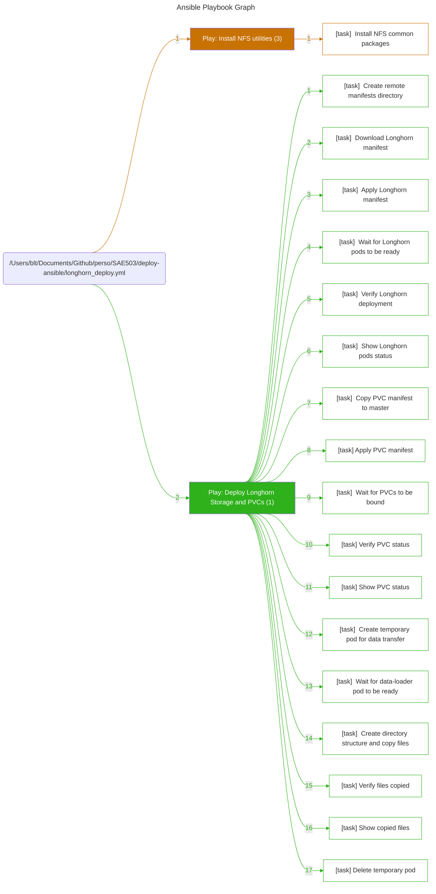

```mermaid
---
title: Ansible Playbook Graph
---
%%{ init: { "flowchart": { "curve": "bumpX" } } }%%
flowchart LR
	%% Start of the playbook '/Users/blt/Documents/Github/perso/SAE503/deploy-ansible/longhorn_deploy.yml'
	playbook_07174a45("/Users/blt/Documents/Github/perso/SAE503/deploy-ansible/longhorn_deploy.yml")
		%% Start of the play 'Play: Install NFS utilities (3)'
		play_49e6dd52["Play: Install NFS utilities (3)"]
		style play_49e6dd52 fill:#c87204,color:#ffffff
		playbook_07174a45 --> |"1"| play_49e6dd52
		linkStyle 0 stroke:#c87204,color:#c87204
			task_d1c6cede["[task]  Install NFS common packages"]
			style task_d1c6cede stroke:#c87204,fill:#ffffff
			play_49e6dd52 --> |"1"| task_d1c6cede
			linkStyle 1 stroke:#c87204,color:#c87204
		%% End of the play 'Play: Install NFS utilities (3)'
		%% Start of the play 'Play: Deploy Longhorn Storage and PVCs (1)'
		play_ea55d69d["Play: Deploy Longhorn Storage and PVCs (1)"]
		style play_ea55d69d fill:#2eb11b,color:#ffffff
		playbook_07174a45 --> |"2"| play_ea55d69d
		linkStyle 2 stroke:#2eb11b,color:#2eb11b
			task_333bb733["[task]  Create remote manifests directory"]
			style task_333bb733 stroke:#2eb11b,fill:#ffffff
			play_ea55d69d --> |"1"| task_333bb733
			linkStyle 3 stroke:#2eb11b,color:#2eb11b
			task_42355b24["[task]  Download Longhorn manifest"]
			style task_42355b24 stroke:#2eb11b,fill:#ffffff
			play_ea55d69d --> |"2"| task_42355b24
			linkStyle 4 stroke:#2eb11b,color:#2eb11b
			task_e3b43c06["[task]  Apply Longhorn manifest"]
			style task_e3b43c06 stroke:#2eb11b,fill:#ffffff
			play_ea55d69d --> |"3"| task_e3b43c06
			linkStyle 5 stroke:#2eb11b,color:#2eb11b
			task_437ee8d3["[task]  Wait for Longhorn pods to be ready"]
			style task_437ee8d3 stroke:#2eb11b,fill:#ffffff
			play_ea55d69d --> |"4"| task_437ee8d3
			linkStyle 6 stroke:#2eb11b,color:#2eb11b
			task_1f94bdf1["[task]  Verify Longhorn deployment"]
			style task_1f94bdf1 stroke:#2eb11b,fill:#ffffff
			play_ea55d69d --> |"5"| task_1f94bdf1
			linkStyle 7 stroke:#2eb11b,color:#2eb11b
			task_28922def["[task]  Show Longhorn pods status"]
			style task_28922def stroke:#2eb11b,fill:#ffffff
			play_ea55d69d --> |"6"| task_28922def
			linkStyle 8 stroke:#2eb11b,color:#2eb11b
			task_17045ad2["[task]  Copy PVC manifest to master"]
			style task_17045ad2 stroke:#2eb11b,fill:#ffffff
			play_ea55d69d --> |"7"| task_17045ad2
			linkStyle 9 stroke:#2eb11b,color:#2eb11b
			task_fde6053f["[task]  Apply PVC manifest"]
			style task_fde6053f stroke:#2eb11b,fill:#ffffff
			play_ea55d69d --> |"8"| task_fde6053f
			linkStyle 10 stroke:#2eb11b,color:#2eb11b
			task_61ac6269["[task]  Wait for PVCs to be bound"]
			style task_61ac6269 stroke:#2eb11b,fill:#ffffff
			play_ea55d69d --> |"9"| task_61ac6269
			linkStyle 11 stroke:#2eb11b,color:#2eb11b
			task_aa5a6588["[task]  Verify PVC status"]
			style task_aa5a6588 stroke:#2eb11b,fill:#ffffff
			play_ea55d69d --> |"10"| task_aa5a6588
			linkStyle 12 stroke:#2eb11b,color:#2eb11b
			task_b9eb346c["[task]  Show PVC status"]
			style task_b9eb346c stroke:#2eb11b,fill:#ffffff
			play_ea55d69d --> |"11"| task_b9eb346c
			linkStyle 13 stroke:#2eb11b,color:#2eb11b
			task_bd65870e["[task]  Create temporary pod for data transfer"]
			style task_bd65870e stroke:#2eb11b,fill:#ffffff
			play_ea55d69d --> |"12"| task_bd65870e
			linkStyle 14 stroke:#2eb11b,color:#2eb11b
			task_3bc15ae3["[task]  Wait for data-loader pod to be ready"]
			style task_3bc15ae3 stroke:#2eb11b,fill:#ffffff
			play_ea55d69d --> |"13"| task_3bc15ae3
			linkStyle 15 stroke:#2eb11b,color:#2eb11b
			task_60af8e96["[task]  Create directory structure and copy files"]
			style task_60af8e96 stroke:#2eb11b,fill:#ffffff
			play_ea55d69d --> |"14"| task_60af8e96
			linkStyle 16 stroke:#2eb11b,color:#2eb11b
			task_2bd362d4["[task]  Verify files copied"]
			style task_2bd362d4 stroke:#2eb11b,fill:#ffffff
			play_ea55d69d --> |"15"| task_2bd362d4
			linkStyle 17 stroke:#2eb11b,color:#2eb11b
			task_25eee184["[task]  Show copied files"]
			style task_25eee184 stroke:#2eb11b,fill:#ffffff
			play_ea55d69d --> |"16"| task_25eee184
			linkStyle 18 stroke:#2eb11b,color:#2eb11b
			task_d73bf616["[task]  Delete temporary pod"]
			style task_d73bf616 stroke:#2eb11b,fill:#ffffff
			play_ea55d69d --> |"17"| task_d73bf616
			linkStyle 19 stroke:#2eb11b,color:#2eb11b
		%% End of the play 'Play: Deploy Longhorn Storage and PVCs (1)'
	%% End of the playbook '/Users/blt/Documents/Github/perso/SAE503/deploy-ansible/longhorn_deploy.yml'

```
