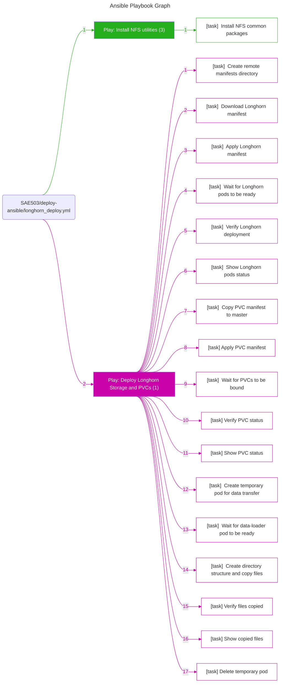

```mermaid
---
title: Ansible Playbook Graph
---
%%{ init: { "flowchart": { "curve": "bumpX" } } }%%
flowchart LR
	%% Start of the playbook 'SAE503/deploy-ansible/longhorn_deploy.yml'
	playbook_f51d045a("SAE503/deploy-ansible/longhorn_deploy.yml")
		%% Start of the play 'Play: Install NFS utilities (3)'
		play_8b75566a["Play: Install NFS utilities (3)"]
		style play_8b75566a fill:#25af1d,color:#ffffff
		playbook_f51d045a --> |"1"| play_8b75566a
		linkStyle 0 stroke:#25af1d,color:#25af1d
			task_f09f77f0["[task]  Install NFS common packages"]
			style task_f09f77f0 stroke:#25af1d,fill:#ffffff
			play_8b75566a --> |"1"| task_f09f77f0
			linkStyle 1 stroke:#25af1d,color:#25af1d
		%% End of the play 'Play: Install NFS utilities (3)'
		%% Start of the play 'Play: Deploy Longhorn Storage and PVCs (1)'
		play_b8277cb8["Play: Deploy Longhorn Storage and PVCs (1)"]
		style play_b8277cb8 fill:#ca02a9,color:#ffffff
		playbook_f51d045a --> |"2"| play_b8277cb8
		linkStyle 2 stroke:#ca02a9,color:#ca02a9
			task_6262ca39["[task]  Create remote manifests directory"]
			style task_6262ca39 stroke:#ca02a9,fill:#ffffff
			play_b8277cb8 --> |"1"| task_6262ca39
			linkStyle 3 stroke:#ca02a9,color:#ca02a9
			task_0b1215fc["[task]  Download Longhorn manifest"]
			style task_0b1215fc stroke:#ca02a9,fill:#ffffff
			play_b8277cb8 --> |"2"| task_0b1215fc
			linkStyle 4 stroke:#ca02a9,color:#ca02a9
			task_ac26e07b["[task]  Apply Longhorn manifest"]
			style task_ac26e07b stroke:#ca02a9,fill:#ffffff
			play_b8277cb8 --> |"3"| task_ac26e07b
			linkStyle 5 stroke:#ca02a9,color:#ca02a9
			task_d1874215["[task]  Wait for Longhorn pods to be ready"]
			style task_d1874215 stroke:#ca02a9,fill:#ffffff
			play_b8277cb8 --> |"4"| task_d1874215
			linkStyle 6 stroke:#ca02a9,color:#ca02a9
			task_ecd83d7a["[task]  Verify Longhorn deployment"]
			style task_ecd83d7a stroke:#ca02a9,fill:#ffffff
			play_b8277cb8 --> |"5"| task_ecd83d7a
			linkStyle 7 stroke:#ca02a9,color:#ca02a9
			task_6d711aae["[task]  Show Longhorn pods status"]
			style task_6d711aae stroke:#ca02a9,fill:#ffffff
			play_b8277cb8 --> |"6"| task_6d711aae
			linkStyle 8 stroke:#ca02a9,color:#ca02a9
			task_24dd2137["[task]  Copy PVC manifest to master"]
			style task_24dd2137 stroke:#ca02a9,fill:#ffffff
			play_b8277cb8 --> |"7"| task_24dd2137
			linkStyle 9 stroke:#ca02a9,color:#ca02a9
			task_a1d934f4["[task]  Apply PVC manifest"]
			style task_a1d934f4 stroke:#ca02a9,fill:#ffffff
			play_b8277cb8 --> |"8"| task_a1d934f4
			linkStyle 10 stroke:#ca02a9,color:#ca02a9
			task_310fe23d["[task]  Wait for PVCs to be bound"]
			style task_310fe23d stroke:#ca02a9,fill:#ffffff
			play_b8277cb8 --> |"9"| task_310fe23d
			linkStyle 11 stroke:#ca02a9,color:#ca02a9
			task_9803483a["[task]  Verify PVC status"]
			style task_9803483a stroke:#ca02a9,fill:#ffffff
			play_b8277cb8 --> |"10"| task_9803483a
			linkStyle 12 stroke:#ca02a9,color:#ca02a9
			task_9b257a66["[task]  Show PVC status"]
			style task_9b257a66 stroke:#ca02a9,fill:#ffffff
			play_b8277cb8 --> |"11"| task_9b257a66
			linkStyle 13 stroke:#ca02a9,color:#ca02a9
			task_43332c0f["[task]  Create temporary pod for data transfer"]
			style task_43332c0f stroke:#ca02a9,fill:#ffffff
			play_b8277cb8 --> |"12"| task_43332c0f
			linkStyle 14 stroke:#ca02a9,color:#ca02a9
			task_b18f5345["[task]  Wait for data-loader pod to be ready"]
			style task_b18f5345 stroke:#ca02a9,fill:#ffffff
			play_b8277cb8 --> |"13"| task_b18f5345
			linkStyle 15 stroke:#ca02a9,color:#ca02a9
			task_98bc0d2e["[task]  Create directory structure and copy files"]
			style task_98bc0d2e stroke:#ca02a9,fill:#ffffff
			play_b8277cb8 --> |"14"| task_98bc0d2e
			linkStyle 16 stroke:#ca02a9,color:#ca02a9
			task_ab741542["[task]  Verify files copied"]
			style task_ab741542 stroke:#ca02a9,fill:#ffffff
			play_b8277cb8 --> |"15"| task_ab741542
			linkStyle 17 stroke:#ca02a9,color:#ca02a9
			task_2497093f["[task]  Show copied files"]
			style task_2497093f stroke:#ca02a9,fill:#ffffff
			play_b8277cb8 --> |"16"| task_2497093f
			linkStyle 18 stroke:#ca02a9,color:#ca02a9
			task_cc9f57b5["[task]  Delete temporary pod"]
			style task_cc9f57b5 stroke:#ca02a9,fill:#ffffff
			play_b8277cb8 --> |"17"| task_cc9f57b5
			linkStyle 19 stroke:#ca02a9,color:#ca02a9
		%% End of the play 'Play: Deploy Longhorn Storage and PVCs (1)'
	%% End of the playbook 'SAE503/deploy-ansible/longhorn_deploy.yml'

```
