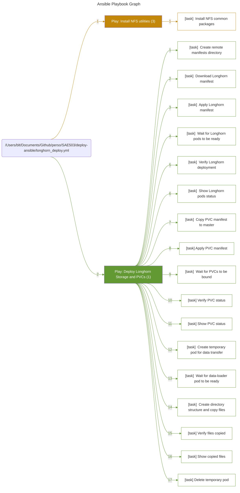

```mermaid
---
title: Ansible Playbook Graph
---
%%{ init: { "flowchart": { "curve": "bumpX" } } }%%
flowchart LR
	%% Start of the playbook '/Users/blt/Documents/Github/perso/SAE503/deploy-ansible/longhorn_deploy.yml'
	playbook_5932eae7("/Users/blt/Documents/Github/perso/SAE503/deploy-ansible/longhorn_deploy.yml")
		%% Start of the play 'Play: Install NFS utilities (3)'
		play_43c233d8["Play: Install NFS utilities (3)"]
		style play_43c233d8 fill:#c38809,color:#ffffff
		playbook_5932eae7 --> |"1"| play_43c233d8
		linkStyle 0 stroke:#c38809,color:#c38809
			task_b5681f95["[task]  Install NFS common packages"]
			style task_b5681f95 stroke:#c38809,fill:#ffffff
			play_43c233d8 --> |"1"| task_b5681f95
			linkStyle 1 stroke:#c38809,color:#c38809
		%% End of the play 'Play: Install NFS utilities (3)'
		%% Start of the play 'Play: Deploy Longhorn Storage and PVCs (1)'
		play_b4629180["Play: Deploy Longhorn Storage and PVCs (1)"]
		style play_b4629180 fill:#629933,color:#ffffff
		playbook_5932eae7 --> |"2"| play_b4629180
		linkStyle 2 stroke:#629933,color:#629933
			task_01fbae6a["[task]  Create remote manifests directory"]
			style task_01fbae6a stroke:#629933,fill:#ffffff
			play_b4629180 --> |"1"| task_01fbae6a
			linkStyle 3 stroke:#629933,color:#629933
			task_1e87ae71["[task]  Download Longhorn manifest"]
			style task_1e87ae71 stroke:#629933,fill:#ffffff
			play_b4629180 --> |"2"| task_1e87ae71
			linkStyle 4 stroke:#629933,color:#629933
			task_49694dd8["[task]  Apply Longhorn manifest"]
			style task_49694dd8 stroke:#629933,fill:#ffffff
			play_b4629180 --> |"3"| task_49694dd8
			linkStyle 5 stroke:#629933,color:#629933
			task_e0c522ac["[task]  Wait for Longhorn pods to be ready"]
			style task_e0c522ac stroke:#629933,fill:#ffffff
			play_b4629180 --> |"4"| task_e0c522ac
			linkStyle 6 stroke:#629933,color:#629933
			task_1e4461ce["[task]  Verify Longhorn deployment"]
			style task_1e4461ce stroke:#629933,fill:#ffffff
			play_b4629180 --> |"5"| task_1e4461ce
			linkStyle 7 stroke:#629933,color:#629933
			task_4d578c73["[task]  Show Longhorn pods status"]
			style task_4d578c73 stroke:#629933,fill:#ffffff
			play_b4629180 --> |"6"| task_4d578c73
			linkStyle 8 stroke:#629933,color:#629933
			task_373d5a85["[task]  Copy PVC manifest to master"]
			style task_373d5a85 stroke:#629933,fill:#ffffff
			play_b4629180 --> |"7"| task_373d5a85
			linkStyle 9 stroke:#629933,color:#629933
			task_ef2e4bc5["[task]  Apply PVC manifest"]
			style task_ef2e4bc5 stroke:#629933,fill:#ffffff
			play_b4629180 --> |"8"| task_ef2e4bc5
			linkStyle 10 stroke:#629933,color:#629933
			task_20c83923["[task]  Wait for PVCs to be bound"]
			style task_20c83923 stroke:#629933,fill:#ffffff
			play_b4629180 --> |"9"| task_20c83923
			linkStyle 11 stroke:#629933,color:#629933
			task_34876fa4["[task]  Verify PVC status"]
			style task_34876fa4 stroke:#629933,fill:#ffffff
			play_b4629180 --> |"10"| task_34876fa4
			linkStyle 12 stroke:#629933,color:#629933
			task_f3f8ab25["[task]  Show PVC status"]
			style task_f3f8ab25 stroke:#629933,fill:#ffffff
			play_b4629180 --> |"11"| task_f3f8ab25
			linkStyle 13 stroke:#629933,color:#629933
			task_0b320fd4["[task]  Create temporary pod for data transfer"]
			style task_0b320fd4 stroke:#629933,fill:#ffffff
			play_b4629180 --> |"12"| task_0b320fd4
			linkStyle 14 stroke:#629933,color:#629933
			task_5b82bdaa["[task]  Wait for data-loader pod to be ready"]
			style task_5b82bdaa stroke:#629933,fill:#ffffff
			play_b4629180 --> |"13"| task_5b82bdaa
			linkStyle 15 stroke:#629933,color:#629933
			task_92ea17fe["[task]  Create directory structure and copy files"]
			style task_92ea17fe stroke:#629933,fill:#ffffff
			play_b4629180 --> |"14"| task_92ea17fe
			linkStyle 16 stroke:#629933,color:#629933
			task_2df0ef2b["[task]  Verify files copied"]
			style task_2df0ef2b stroke:#629933,fill:#ffffff
			play_b4629180 --> |"15"| task_2df0ef2b
			linkStyle 17 stroke:#629933,color:#629933
			task_335e2e8f["[task]  Show copied files"]
			style task_335e2e8f stroke:#629933,fill:#ffffff
			play_b4629180 --> |"16"| task_335e2e8f
			linkStyle 18 stroke:#629933,color:#629933
			task_10cec640["[task]  Delete temporary pod"]
			style task_10cec640 stroke:#629933,fill:#ffffff
			play_b4629180 --> |"17"| task_10cec640
			linkStyle 19 stroke:#629933,color:#629933
		%% End of the play 'Play: Deploy Longhorn Storage and PVCs (1)'
	%% End of the playbook '/Users/blt/Documents/Github/perso/SAE503/deploy-ansible/longhorn_deploy.yml'

```
