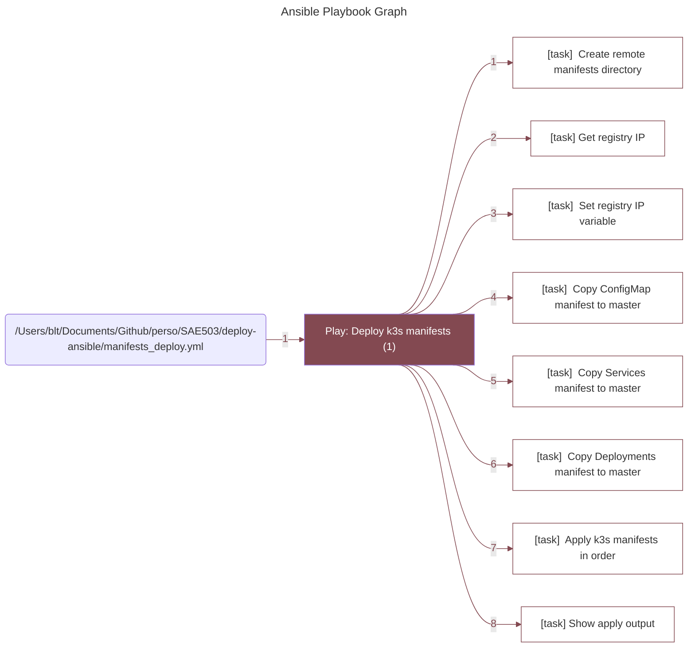

```mermaid
---
title: Ansible Playbook Graph
---
%%{ init: { "flowchart": { "curve": "bumpX" } } }%%
flowchart LR
	%% Start of the playbook '/Users/blt/Documents/Github/perso/SAE503/deploy-ansible/manifests_deploy.yml'
	playbook_350624af("/Users/blt/Documents/Github/perso/SAE503/deploy-ansible/manifests_deploy.yml")
		%% Start of the play 'Play: Deploy k3s manifests (1)'
		play_eb09909e["Play: Deploy k3s manifests (1)"]
		style play_eb09909e fill:#834951,color:#ffffff
		playbook_350624af --> |"1"| play_eb09909e
		linkStyle 0 stroke:#834951,color:#834951
			task_6a75d38c["[task]  Create remote manifests directory"]
			style task_6a75d38c stroke:#834951,fill:#ffffff
			play_eb09909e --> |"1"| task_6a75d38c
			linkStyle 1 stroke:#834951,color:#834951
			task_c435a81a["[task]  Get registry IP"]
			style task_c435a81a stroke:#834951,fill:#ffffff
			play_eb09909e --> |"2"| task_c435a81a
			linkStyle 2 stroke:#834951,color:#834951
			task_e89f409a["[task]  Set registry IP variable"]
			style task_e89f409a stroke:#834951,fill:#ffffff
			play_eb09909e --> |"3"| task_e89f409a
			linkStyle 3 stroke:#834951,color:#834951
			task_db7f1e21["[task]  Copy ConfigMap manifest to master"]
			style task_db7f1e21 stroke:#834951,fill:#ffffff
			play_eb09909e --> |"4"| task_db7f1e21
			linkStyle 4 stroke:#834951,color:#834951
			task_e84a9169["[task]  Copy Services manifest to master"]
			style task_e84a9169 stroke:#834951,fill:#ffffff
			play_eb09909e --> |"5"| task_e84a9169
			linkStyle 5 stroke:#834951,color:#834951
			task_22c02942["[task]  Copy Deployments manifest to master"]
			style task_22c02942 stroke:#834951,fill:#ffffff
			play_eb09909e --> |"6"| task_22c02942
			linkStyle 6 stroke:#834951,color:#834951
			task_10496376["[task]  Apply k3s manifests in order"]
			style task_10496376 stroke:#834951,fill:#ffffff
			play_eb09909e --> |"7"| task_10496376
			linkStyle 7 stroke:#834951,color:#834951
			task_7e9a9fa3["[task]  Show apply output"]
			style task_7e9a9fa3 stroke:#834951,fill:#ffffff
			play_eb09909e --> |"8"| task_7e9a9fa3
			linkStyle 8 stroke:#834951,color:#834951
		%% End of the play 'Play: Deploy k3s manifests (1)'
	%% End of the playbook '/Users/blt/Documents/Github/perso/SAE503/deploy-ansible/manifests_deploy.yml'

```
