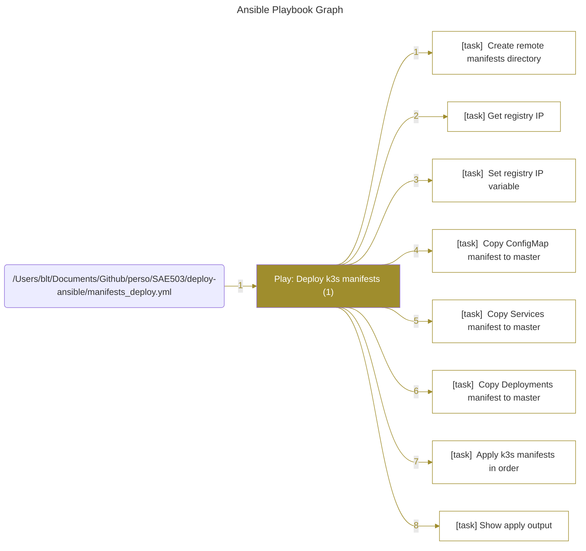

```mermaid
---
title: Ansible Playbook Graph
---
%%{ init: { "flowchart": { "curve": "bumpX" } } }%%
flowchart LR
	%% Start of the playbook '/Users/blt/Documents/Github/perso/SAE503/deploy-ansible/manifests_deploy.yml'
	playbook_e42e6076("/Users/blt/Documents/Github/perso/SAE503/deploy-ansible/manifests_deploy.yml")
		%% Start of the play 'Play: Deploy k3s manifests (1)'
		play_ac63fe5f["Play: Deploy k3s manifests (1)"]
		style play_ac63fe5f fill:#9f8d2d,color:#ffffff
		playbook_e42e6076 --> |"1"| play_ac63fe5f
		linkStyle 0 stroke:#9f8d2d,color:#9f8d2d
			task_d768a45f["[task]  Create remote manifests directory"]
			style task_d768a45f stroke:#9f8d2d,fill:#ffffff
			play_ac63fe5f --> |"1"| task_d768a45f
			linkStyle 1 stroke:#9f8d2d,color:#9f8d2d
			task_993b9c5a["[task]  Get registry IP"]
			style task_993b9c5a stroke:#9f8d2d,fill:#ffffff
			play_ac63fe5f --> |"2"| task_993b9c5a
			linkStyle 2 stroke:#9f8d2d,color:#9f8d2d
			task_930b3fbc["[task]  Set registry IP variable"]
			style task_930b3fbc stroke:#9f8d2d,fill:#ffffff
			play_ac63fe5f --> |"3"| task_930b3fbc
			linkStyle 3 stroke:#9f8d2d,color:#9f8d2d
			task_27571e9e["[task]  Copy ConfigMap manifest to master"]
			style task_27571e9e stroke:#9f8d2d,fill:#ffffff
			play_ac63fe5f --> |"4"| task_27571e9e
			linkStyle 4 stroke:#9f8d2d,color:#9f8d2d
			task_70d4366f["[task]  Copy Services manifest to master"]
			style task_70d4366f stroke:#9f8d2d,fill:#ffffff
			play_ac63fe5f --> |"5"| task_70d4366f
			linkStyle 5 stroke:#9f8d2d,color:#9f8d2d
			task_8ad47e26["[task]  Copy Deployments manifest to master"]
			style task_8ad47e26 stroke:#9f8d2d,fill:#ffffff
			play_ac63fe5f --> |"6"| task_8ad47e26
			linkStyle 6 stroke:#9f8d2d,color:#9f8d2d
			task_afc62228["[task]  Apply k3s manifests in order"]
			style task_afc62228 stroke:#9f8d2d,fill:#ffffff
			play_ac63fe5f --> |"7"| task_afc62228
			linkStyle 7 stroke:#9f8d2d,color:#9f8d2d
			task_32b6c833["[task]  Show apply output"]
			style task_32b6c833 stroke:#9f8d2d,fill:#ffffff
			play_ac63fe5f --> |"8"| task_32b6c833
			linkStyle 8 stroke:#9f8d2d,color:#9f8d2d
		%% End of the play 'Play: Deploy k3s manifests (1)'
	%% End of the playbook '/Users/blt/Documents/Github/perso/SAE503/deploy-ansible/manifests_deploy.yml'

```
