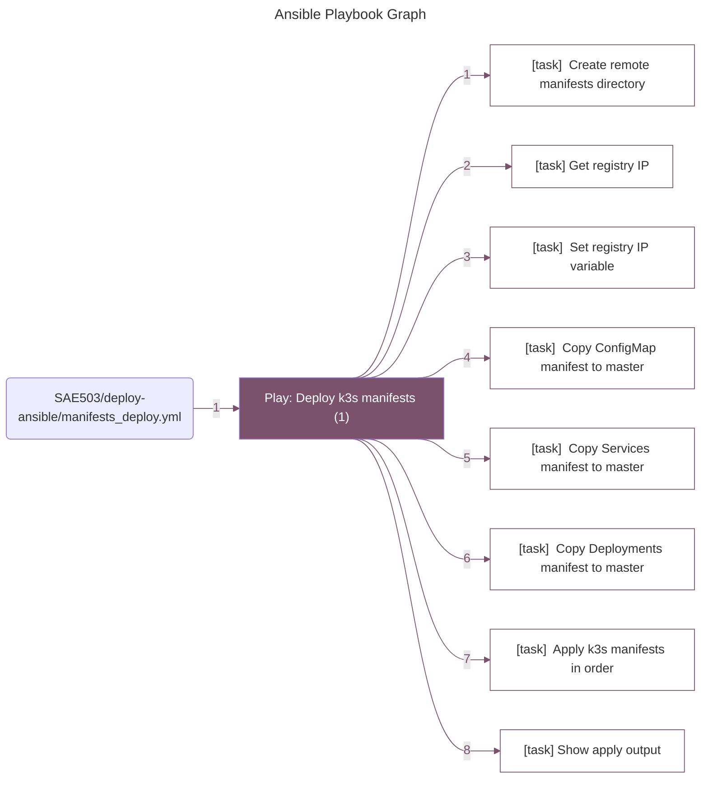

```mermaid
---
title: Ansible Playbook Graph
---
%%{ init: { "flowchart": { "curve": "bumpX" } } }%%
flowchart LR
	%% Start of the playbook 'SAE503/deploy-ansible/manifests_deploy.yml'
	playbook_3d6f821c("SAE503/deploy-ansible/manifests_deploy.yml")
		%% Start of the play 'Play: Deploy k3s manifests (1)'
		play_1a453307["Play: Deploy k3s manifests (1)"]
		style play_1a453307 fill:#7a526c,color:#ffffff
		playbook_3d6f821c --> |"1"| play_1a453307
		linkStyle 0 stroke:#7a526c,color:#7a526c
			task_ecefef8b["[task]  Create remote manifests directory"]
			style task_ecefef8b stroke:#7a526c,fill:#ffffff
			play_1a453307 --> |"1"| task_ecefef8b
			linkStyle 1 stroke:#7a526c,color:#7a526c
			task_610bf271["[task]  Get registry IP"]
			style task_610bf271 stroke:#7a526c,fill:#ffffff
			play_1a453307 --> |"2"| task_610bf271
			linkStyle 2 stroke:#7a526c,color:#7a526c
			task_6e21daaf["[task]  Set registry IP variable"]
			style task_6e21daaf stroke:#7a526c,fill:#ffffff
			play_1a453307 --> |"3"| task_6e21daaf
			linkStyle 3 stroke:#7a526c,color:#7a526c
			task_f660a261["[task]  Copy ConfigMap manifest to master"]
			style task_f660a261 stroke:#7a526c,fill:#ffffff
			play_1a453307 --> |"4"| task_f660a261
			linkStyle 4 stroke:#7a526c,color:#7a526c
			task_66afeb57["[task]  Copy Services manifest to master"]
			style task_66afeb57 stroke:#7a526c,fill:#ffffff
			play_1a453307 --> |"5"| task_66afeb57
			linkStyle 5 stroke:#7a526c,color:#7a526c
			task_bdc12f7b["[task]  Copy Deployments manifest to master"]
			style task_bdc12f7b stroke:#7a526c,fill:#ffffff
			play_1a453307 --> |"6"| task_bdc12f7b
			linkStyle 6 stroke:#7a526c,color:#7a526c
			task_a39abc1e["[task]  Apply k3s manifests in order"]
			style task_a39abc1e stroke:#7a526c,fill:#ffffff
			play_1a453307 --> |"7"| task_a39abc1e
			linkStyle 7 stroke:#7a526c,color:#7a526c
			task_50e5efd9["[task]  Show apply output"]
			style task_50e5efd9 stroke:#7a526c,fill:#ffffff
			play_1a453307 --> |"8"| task_50e5efd9
			linkStyle 8 stroke:#7a526c,color:#7a526c
		%% End of the play 'Play: Deploy k3s manifests (1)'
	%% End of the playbook 'SAE503/deploy-ansible/manifests_deploy.yml'

```
