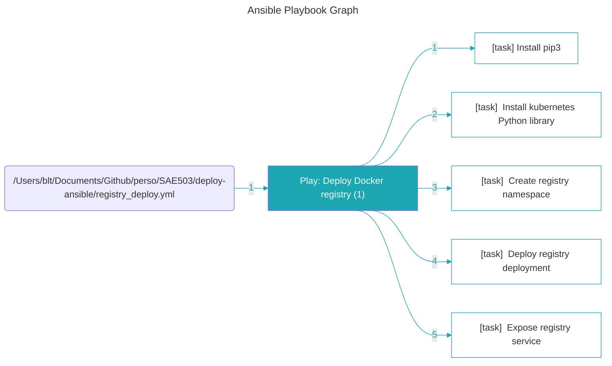

```mermaid
---
title: Ansible Playbook Graph
---
%%{ init: { "flowchart": { "curve": "bumpX" } } }%%
flowchart LR
	%% Start of the playbook '/Users/blt/Documents/Github/perso/SAE503/deploy-ansible/registry_deploy.yml'
	playbook_2c8462c5("/Users/blt/Documents/Github/perso/SAE503/deploy-ansible/registry_deploy.yml")
		%% Start of the play 'Play: Deploy Docker registry (1)'
		play_d0f6f590["Play: Deploy Docker registry (1)"]
		style play_d0f6f590 fill:#1aa7b2,color:#ffffff
		playbook_2c8462c5 --> |"1"| play_d0f6f590
		linkStyle 0 stroke:#1aa7b2,color:#1aa7b2
			task_e463739f["[task]  Install pip3"]
			style task_e463739f stroke:#1aa7b2,fill:#ffffff
			play_d0f6f590 --> |"1"| task_e463739f
			linkStyle 1 stroke:#1aa7b2,color:#1aa7b2
			task_9f2988d9["[task]  Install kubernetes Python library"]
			style task_9f2988d9 stroke:#1aa7b2,fill:#ffffff
			play_d0f6f590 --> |"2"| task_9f2988d9
			linkStyle 2 stroke:#1aa7b2,color:#1aa7b2
			task_735626ba["[task]  Create registry namespace"]
			style task_735626ba stroke:#1aa7b2,fill:#ffffff
			play_d0f6f590 --> |"3"| task_735626ba
			linkStyle 3 stroke:#1aa7b2,color:#1aa7b2
			task_87206e14["[task]  Deploy registry deployment"]
			style task_87206e14 stroke:#1aa7b2,fill:#ffffff
			play_d0f6f590 --> |"4"| task_87206e14
			linkStyle 4 stroke:#1aa7b2,color:#1aa7b2
			task_f46ac2b1["[task]  Expose registry service"]
			style task_f46ac2b1 stroke:#1aa7b2,fill:#ffffff
			play_d0f6f590 --> |"5"| task_f46ac2b1
			linkStyle 5 stroke:#1aa7b2,color:#1aa7b2
		%% End of the play 'Play: Deploy Docker registry (1)'
	%% End of the playbook '/Users/blt/Documents/Github/perso/SAE503/deploy-ansible/registry_deploy.yml'

```
