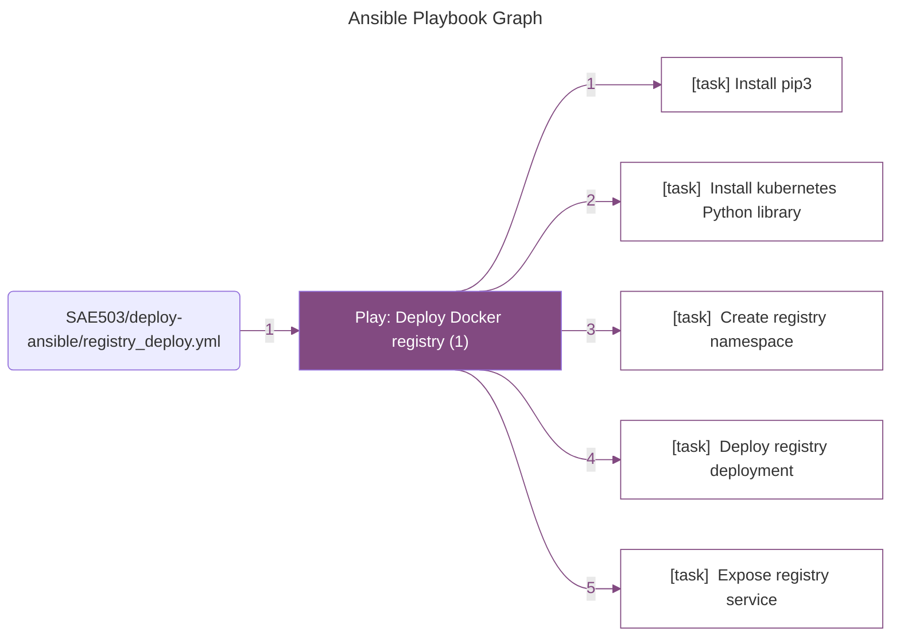

```mermaid
---
title: Ansible Playbook Graph
---
%%{ init: { "flowchart": { "curve": "bumpX" } } }%%
flowchart LR
	%% Start of the playbook 'SAE503/deploy-ansible/registry_deploy.yml'
	playbook_0c2838e9("SAE503/deploy-ansible/registry_deploy.yml")
		%% Start of the play 'Play: Deploy Docker registry (1)'
		play_4db51175["Play: Deploy Docker registry (1)"]
		style play_4db51175 fill:#824a81,color:#ffffff
		playbook_0c2838e9 --> |"1"| play_4db51175
		linkStyle 0 stroke:#824a81,color:#824a81
			task_971f9dba["[task]  Install pip3"]
			style task_971f9dba stroke:#824a81,fill:#ffffff
			play_4db51175 --> |"1"| task_971f9dba
			linkStyle 1 stroke:#824a81,color:#824a81
			task_8d1022cb["[task]  Install kubernetes Python library"]
			style task_8d1022cb stroke:#824a81,fill:#ffffff
			play_4db51175 --> |"2"| task_8d1022cb
			linkStyle 2 stroke:#824a81,color:#824a81
			task_578190dd["[task]  Create registry namespace"]
			style task_578190dd stroke:#824a81,fill:#ffffff
			play_4db51175 --> |"3"| task_578190dd
			linkStyle 3 stroke:#824a81,color:#824a81
			task_2ce6d170["[task]  Deploy registry deployment"]
			style task_2ce6d170 stroke:#824a81,fill:#ffffff
			play_4db51175 --> |"4"| task_2ce6d170
			linkStyle 4 stroke:#824a81,color:#824a81
			task_f0a6db4e["[task]  Expose registry service"]
			style task_f0a6db4e stroke:#824a81,fill:#ffffff
			play_4db51175 --> |"5"| task_f0a6db4e
			linkStyle 5 stroke:#824a81,color:#824a81
		%% End of the play 'Play: Deploy Docker registry (1)'
	%% End of the playbook 'SAE503/deploy-ansible/registry_deploy.yml'

```
