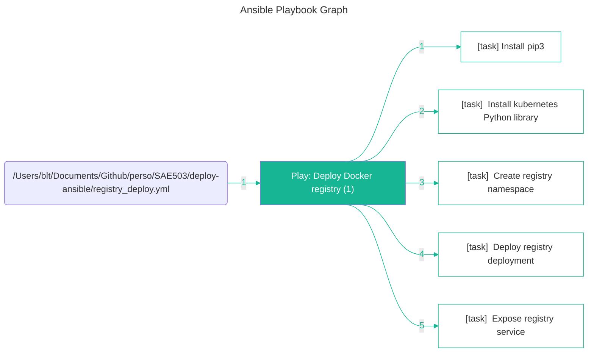

```mermaid
---
title: Ansible Playbook Graph
---
%%{ init: { "flowchart": { "curve": "bumpX" } } }%%
flowchart LR
	%% Start of the playbook '/Users/blt/Documents/Github/perso/SAE503/deploy-ansible/registry_deploy.yml'
	playbook_ddc4c294("/Users/blt/Documents/Github/perso/SAE503/deploy-ansible/registry_deploy.yml")
		%% Start of the play 'Play: Deploy Docker registry (1)'
		play_7ba024e9["Play: Deploy Docker registry (1)"]
		style play_7ba024e9 fill:#16b695,color:#ffffff
		playbook_ddc4c294 --> |"1"| play_7ba024e9
		linkStyle 0 stroke:#16b695,color:#16b695
			task_1c69a918["[task]  Install pip3"]
			style task_1c69a918 stroke:#16b695,fill:#ffffff
			play_7ba024e9 --> |"1"| task_1c69a918
			linkStyle 1 stroke:#16b695,color:#16b695
			task_2e607b06["[task]  Install kubernetes Python library"]
			style task_2e607b06 stroke:#16b695,fill:#ffffff
			play_7ba024e9 --> |"2"| task_2e607b06
			linkStyle 2 stroke:#16b695,color:#16b695
			task_8d83470a["[task]  Create registry namespace"]
			style task_8d83470a stroke:#16b695,fill:#ffffff
			play_7ba024e9 --> |"3"| task_8d83470a
			linkStyle 3 stroke:#16b695,color:#16b695
			task_ff97b8a4["[task]  Deploy registry deployment"]
			style task_ff97b8a4 stroke:#16b695,fill:#ffffff
			play_7ba024e9 --> |"4"| task_ff97b8a4
			linkStyle 4 stroke:#16b695,color:#16b695
			task_65423fb2["[task]  Expose registry service"]
			style task_65423fb2 stroke:#16b695,fill:#ffffff
			play_7ba024e9 --> |"5"| task_65423fb2
			linkStyle 5 stroke:#16b695,color:#16b695
		%% End of the play 'Play: Deploy Docker registry (1)'
	%% End of the playbook '/Users/blt/Documents/Github/perso/SAE503/deploy-ansible/registry_deploy.yml'

```
